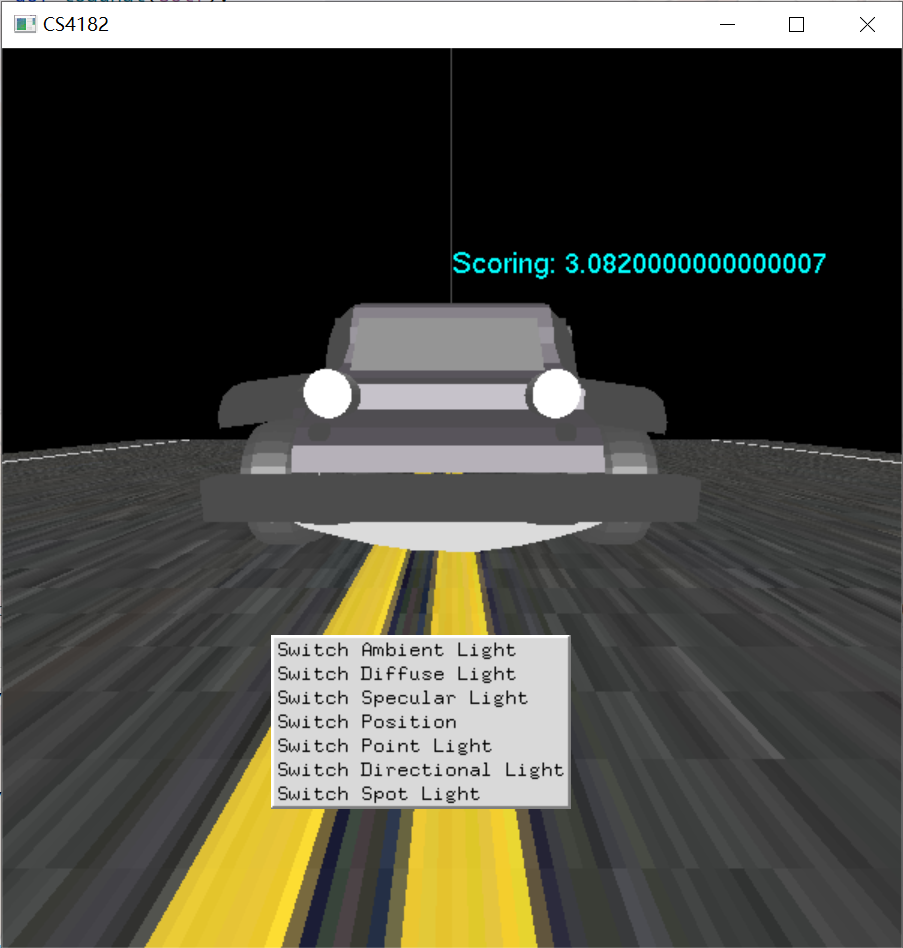
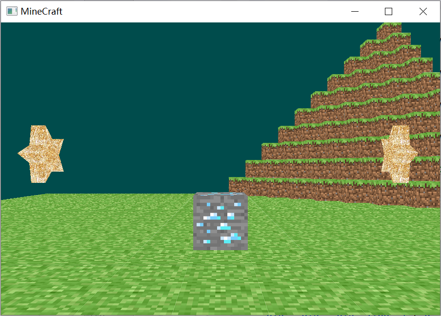

# OpenGL-CS4182

This is a project of CS4182 Computer Graphics. The reason of uploading this repository are:

1. My friend uploaded his project;
2. To prove that I have learned OpenGL (although the effect is not good in my current view);
3. To save the space of my computer.

Now that I have uploaded it, I may improve it when time allows.

*Note:* For installing PyOpenGL, please access to https://www.lfd.uci.edu/~gohlke/pythonlibs/#pyopengl and download the corresponding python version of package.

